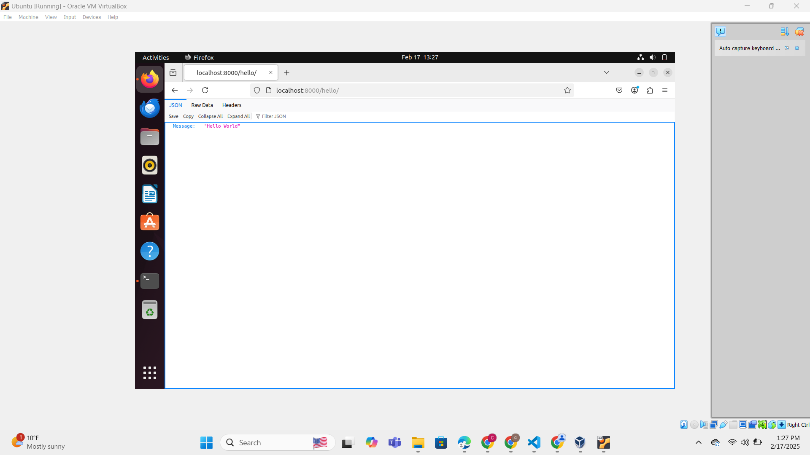

# Django Hello World App

## Overview

This project is a basic Django application that serves a "Hello World!" message via a JSON response as required for the Week - 5 Assignment of Software Architecture Course.

The `/hello` endpoint returns the following JSON response:

```json
{
  "Message": "Hello World!"
}
```

## Requirements

* Python - 3.x
* Django
* Git

## Project Setup

Execute the following command to first clone the project in your machine

``` bash
git clone https://github.com/chanikya-reddy-7/Django-HelloWorld.git
```

Then cd into the Project Folder

``` bash
cd Django-HelloWorld
```

Then the next step involves setting up of the setting up of the Virtual Environment (Creation and Activation)

Execute the following commands:

> For Linux
``` bash
python3 -m venv app

source app/bin/activate
```

> For Windows
``` nginx
python -m venv app

app\Scripts\activate
```

## Project Execution

Once the Virtual environment in activated, run the following command to install all the required dependencies.

``` nginx
pip install -r requirements.txt
```

After that first run the following command to run the database migrations

``` nginx
python manage.py migrate
```

Finally, run the following command to start the Server.

``` nginx
python manage.py runserver
```

## Usage

* Open any browser in the Device and navigate to: ```http://127.0.0.1:8000/hello/```
or ```localhost:8000/hello/```
* You should see the following JSON Response on the screen:
```json
{
  "Message": "Hello World!"
}
```

## Output Screenshot

This is how the output looks:

